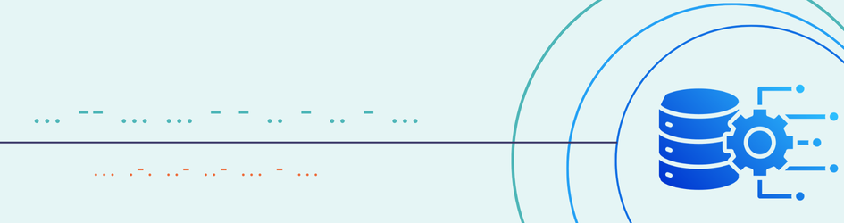

 

# Hi, I'm Phil!
I'm an ETL & Traditional Datawarehouse Developer and an Aspiring Data Engineer. Passionate about Data Integration, Analytics and Cloud Computing.

# Projects & Learnings
This section is a work in progress. Check back frequently as I upload my projects for this year.
 
<!-- ### Python Programming -->
### 

- **1. Task Manager Web App** - <a href="https://github.com/philph01/Flask-Task-Mgr-CRUD">Simple Task Management Tool with FLask API in Python</a> 

<!-- ### Power BI Visuals -->
### 
- **1. Basic Sales Dashboard** - <a href="https://github.com/philph01/Cola-Basic-Sales-Dashboard">Basic Sales Dashboard using Power BI</a> 
- **2. Airline Flights Dashboard** - <a href="https://github.com/philph01/Airline-Flights-Dashboard">Airline Flights Dashboard using Power BI, DAX measures</a> 

<!-- ### SQLs, ETLs, Data Warehousing -->
### 
- **1. Weather Data Pipeline** - <a href="https://github.com/philph01">Weather Data Pipeline using Python and PostgreSQL</a> 

<!-- ### AWS Cloud Projects -->
### 
- **1. TrixieLytics Website** - <a href="https://github.com/philph01/trixielytics-analytics-website">Static website for startup company using HTML, CSS, AWS S3 and AWS Amplify</a> 
- **2. COVID-19 Analysis Report** - <a href="https://github.com/philph01/covid19-analysis-report-quicksight">COVID-19 Analysis Report Visualizations Using S3 and QuickSight</a> 
- **3. Amazon Best Seller Report** - <a href="https://github.com/philph01">Amazon Best Seller Report using S3 and QuickSight</a> 

<!-- Most Used Languages -->

## Currently Working On
- **AWS Cloud Development**: Building foundational knowledge with **AWS** services like **S3**, **Redshift**, **Glue**, and **Lambda** for data engineering projects.
- **Snowflake**: Diving deeper into **Snowflake** for cloud-based data warehousing and analytics solutions.
- **Python Projects**: Focusing on personal **Python** projects to strengthen my programming and data manipulation skills, as well as my understanding of automation and data workflows.
- **Certifications & Learning**: Continuing my learning path with **AWS**, and exploring **Snowflake** certifications and other data engineering tools.

### 🎓 Certifications
- **AWS Certified Cloud Practitioner** (2025) - Acknowledging my foundational AWS cloud skills and knowledge.
- **DataCamp Data Engineer Associate** (2024). 
- **Informatica Certified PowerCenter Data Integration Developer** (2023) - Expertise in building and managing ETL processes and data integration pipelines.

<!--
# 📊 🚀 🛠️ GitHub Stats:
 
 
-->

## 🌐 Socials
 

 
Profile Photo <a href="http://www.freepik.com">Designed by pikisuperstar / Freepik</a> 

<b>Tech Stack</b> 
<!-- Monochrome Color Stack -->
                 

<!-- TechNiColor
                  
-->

 <b>Badges</b> 

---
<!-- 

-->
<!-- Proudly created with GPRM ( https://gprm.itsvg.in ) -->
